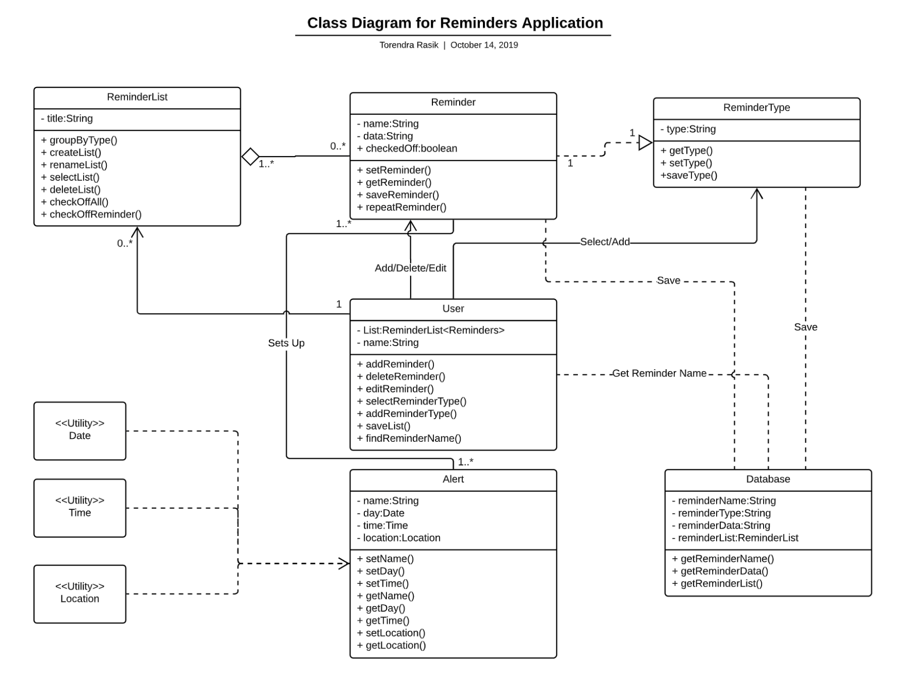
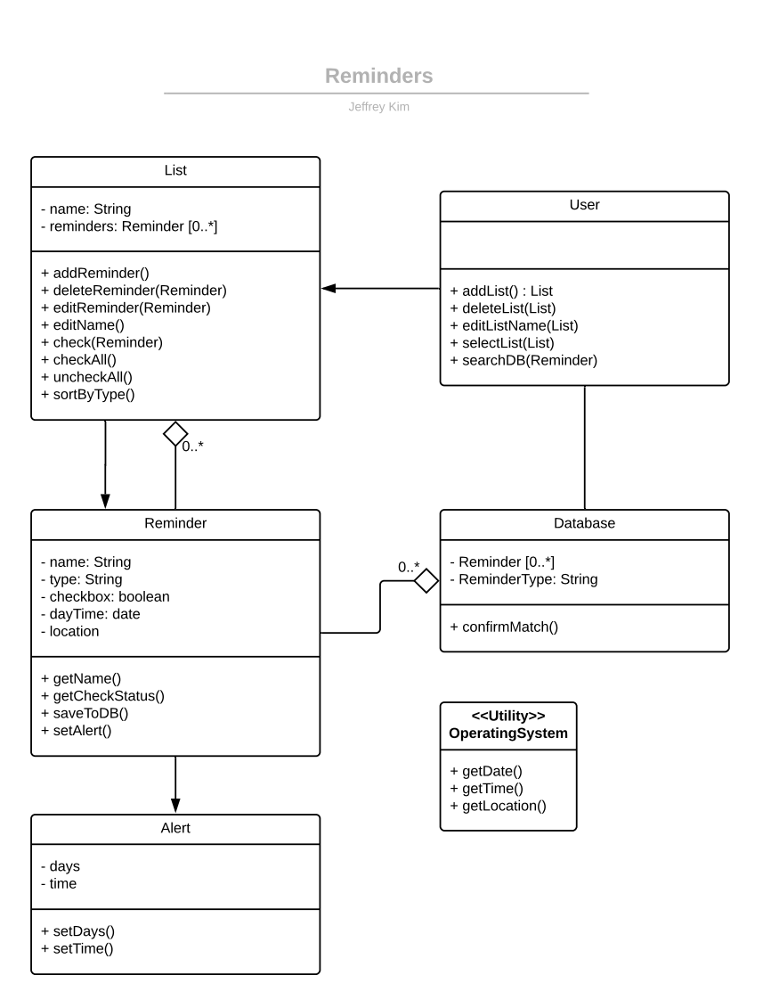
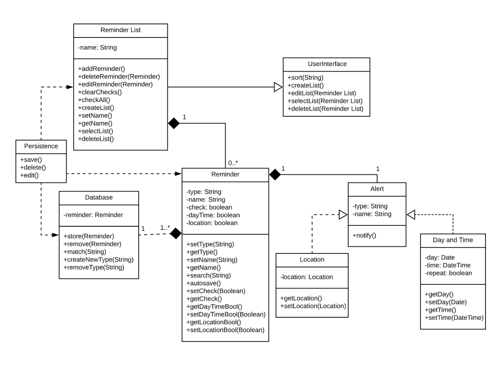

# Design Discussion

## Design 1 (Daniel Rand):

### Pros:
    1. Very detailed oriented in a way that all the method names and attributes are clear/understandable. -T.R
    2. The relationships between (User and Reminder) and (Reminder and ReminderList) justify the requirements between them. -T.R

### Cons:
    1. Although there are methods within the User class to create ReminderList, the design shows no relationship between Users and the ReminderLists they create. -T.R
    2. I believe that within the design, you could possibly include utility classes to handle arbitrary values of Time, Date, Location. -T.R
    3. One of the requirements asks for a hierarchical format for Reminders where their type and names are seperate which could be added to the design. -T.R

## Design 2 (Nana Kodjo Acquah):

### Pros:
    1. I like how you included a Priority class to check whether or not a Reminder is important or not. -T.R
    2. Very nice use of the dependency relationships along with aggregations to explicitly show that the ReminderList has Reminders. -T.R

### Cons:
    1. There is redundant information within the design where the methods within the User class seem to be classes of their own. -T.R
    2. This design could be refactored more to a point where we can get rid of 6 exisiting classes inorder to have a more compact, crisp layout. -T.R

## Design 3 (Torendra Rasik):

### Pros:

### Cons:

## Design 4 (Jeffrey Kim):

### Pros:
    1. Very nice use of including a Utility class to show we can get Time, Date, and Location from the Android OS. -T.R
    2. Very compact design that gives enough information to answer all requirements, while clearly showing the inheritance of Reminder to List. -T.R

### Cons:
    1. I do believe we can split the type and name of the Reminder into two seperate classes where we can save them correspondingly and lets us display them in the UI easier. -T.R
    2. Maybe we shouldn't say that there's an aggregation between a Reminder and the Database because the database basically saves everything within the App, so the App is just dependant of the database. -T.R

## Design 5 (Jonas Improgo):

### Pros:
    1. I like how you used a Persistence class as the middleware between the ReminderList and the Database to show all the saving is done through that class. -T.R
    2. Really good use of the dependency relationship between classes to show that if one changes there may be changes throughout the Application. -T.R

### Cons:
    1. I believe the User Interface class shouldn't be there because it's intuitive, therefore we can move the methods within it to a User class. -T.R
    2. I believe we could replace the composition relationships between some classes e.g ReminderList and Reminder with Aggregation relationships to show that a ReminderList has Reminders. -T.R
    3. We could see the OS to retrieve the Date, Time, and Location for us instead of creating classes for them as Jeffrey did. -T.R

# Team Design:

# Summary:

