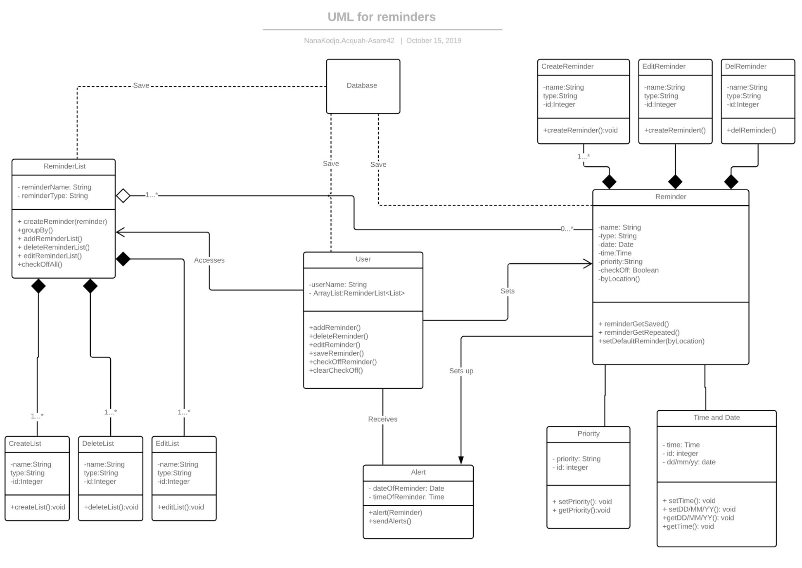
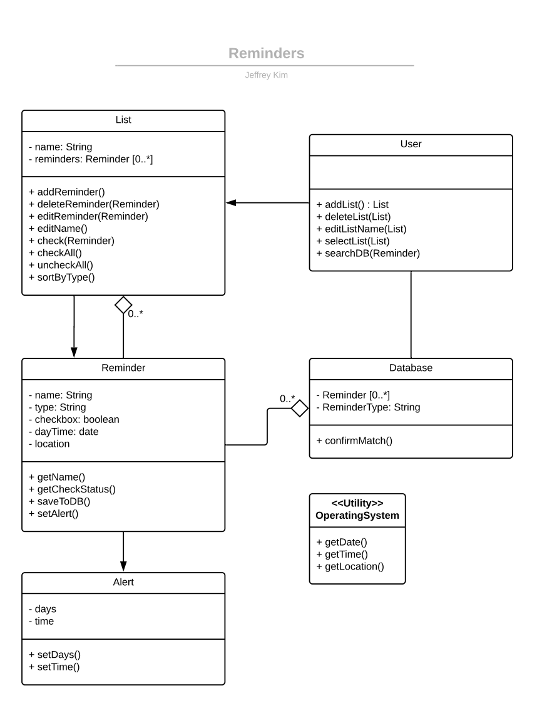
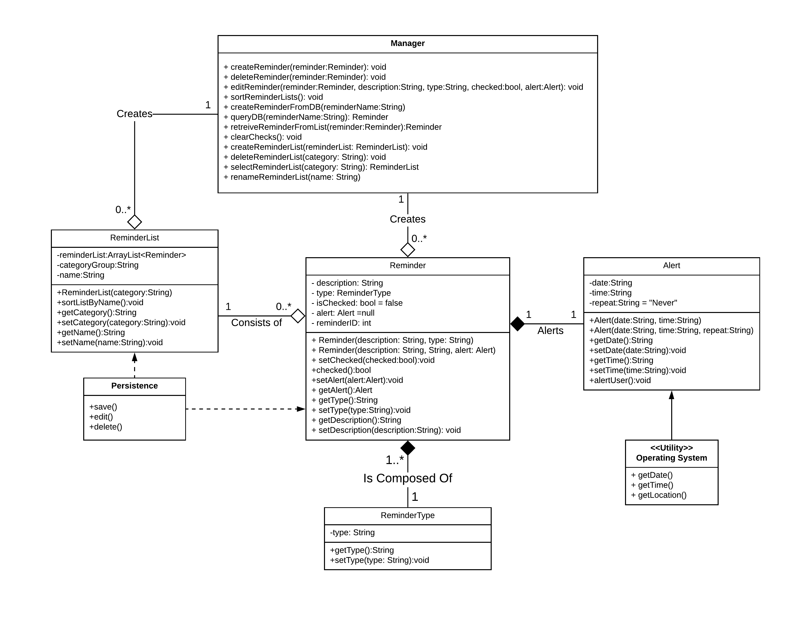

# Design Discussion

## Design 1 (Daniel Rand):

### Pros:
    1. Very detailed oriented in a way that all the method names and attributes are clear/understandable.
    2. The relationships between (User and Reminder) and (Reminder and ReminderList) justify the requirements between them.
    3. Straightforward and simple design that consists of several methods that would be implemented into the application.
    4. The User class’ attributes allows for the application to log into a device with their information rather than to a designated device.
	5. Very fleshed out diagram with method names that are clear how they interact with other classes. 

### Cons:
    1. Although there are methods within the User class to create ReminderList, the design shows no relationship between Users and the ReminderLists they create.
    2. I believe that within the design, you could possibly include utility classes to handle arbitrary values of Time, Date, Location.
    3. One of the requirements asks for a hierarchical format for Reminders where their type and names are seperate which could be added to the design.
    4. There seems to be no relationship between the User and the ReminderList to allow the User to manage it. 
	5. Can use a connection between the User class and ReminderList class so User can create ReminderLists directly like they do Reminders. 

## Design 2 (Nana Kodjo Acquah):

### Pros:
    1. I like how you included a Priority class to check whether or not a Reminder is important or not.
    2. Very nice use of the dependency relationships along with aggregations to explicitly show that the ReminderList has Reminders. 
    3. The explanations in the relationships is helpful to understand the design of the application.
    4. The idea of a User directly receiving an Alert seems to be better than a User receiving an Alert from a Reminder.
	5. Nice use of relationships to show how everything is connected. 

### Cons:
    1. There is redundant information within the design where the methods within the User class seem to be classes of their own. 
    2. This design could be refactored more to a point where we can get rid of 6 exisiting classes inorder to have a more compact, crisp layout.
    3. The design appears to be convoluted and could be simplified. Instead of creating new classes, it can be handled as a method.
	4. The extra classes to create, edit, and delete can just be methods in the ReminderList and Reminder class.
	5. Can use more information of what kind of data is stored in the database.

## Design 3 (Torendra Rasik):

### Pros:
    1. The design displays all of the possible classes and necessary relationships needed to complete the requirements. 
    2. The use of a Utility class gets rid of the need to create separate classes to get the Date/Time/Location for an Alert.
	3. Having a separate class for ReminderType can be useful for keeping track of what types are available.

### Cons:
    1. The hierarchical aspect in the requirements could possibly be handled in the Reminder class instead of in its own separate class.
    2. The use of a ReminderList in the Database class may not be necessary as it should only contain Reminders.
	3. Give the User class methods to create and modify ReminderLists like how they can for Reminders.

## Design 4 (Jeffrey Kim):

### Pros:
    1. Very nice use of including a Utility class to show we can get Time, Date, and Location from the Android OS.
    2. Very compact design that gives enough information to answer all requirements, while clearly showing the inheritance of Reminder to List.
    3. Simple and clear design that meets the requirements of the application.
    

### Cons:
    1. I do believe we can split the type and name of the Reminder into two seperate classes where we can save them correspondingly and lets us display them in the UI easier.
    2. Maybe we shouldn't say that there's an aggregation between a Reminder and the Database because the database basically saves everything within the App, so the App is just dependant of the database.
    3. The User may need to be able to create a Reminder on its own and a List on its own. The current design implies that the User cannot create a Reminder without first creating a List.

## Design 5 (Jonas Improgo):

### Pros:
    1. I like how you used a Persistence class as the middleware between the ReminderList and the Database to show all the saving is done through that class.
    2. Really good use of the dependency relationship between classes to show that if one changes there may be changes throughout the Application.
	3. Use of a Persistence class to keep track of saving and deleting information.

### Cons:
    1. I believe the User Interface class shouldn't be there because it's intuitive, therefore we can move the methods within it to a User class.
    2. I believe we could replace the composition relationships between some classes e.g ReminderList and Reminder with Aggregation relationships to show that a ReminderList has Reminders.
    3. We could see the OS to retrieve the Date, Time, and Location for us instead of creating classes for them as Jeffrey did.
	4. Instead of the UserInterface, a User class can be made to be able to create and modify Reminders and ReminderLists.

# Team Design:

 The team design branched off of Daniel Rand’s design and maintained the main classes that all of our individual designs consisted of, which includes the Reminder, ReminderList, and Alert classes. Despite the fact that we have Databases in all of our designs, we removed it from the main design as it does not need to be represented in a UML diagram. While a User class could be a good feature to have, it is not necessary for a regular Reminder application. To handle all of the essential parts of the application, which includes creating, editing, and/or deleting Reminders or ReminderLists, we added a Manager class to the design. We also added a ReminderType class to allow a user to select through a list of types hierarchically. A Persistence class was created to ensure that the data is saved throughout the application for Reminders and ReminderLists. Lastly, we included a Utility class that is embedded in the device’s operating system for the Alert class to be able to receive the date, time, and/or location. 

	
# Summary:

 Throughout the process of discussion of the designs, we learned to take constructive criticism from all of our individual designs and adapt it towards the main design. We transferred the important aspects from each design that would be needed to fulfill the requirements and found what needed to be prioritized and what was unnecessary. We worked together to create a diagram that we would all be able to understand so that we would be able to implement it into code. 

