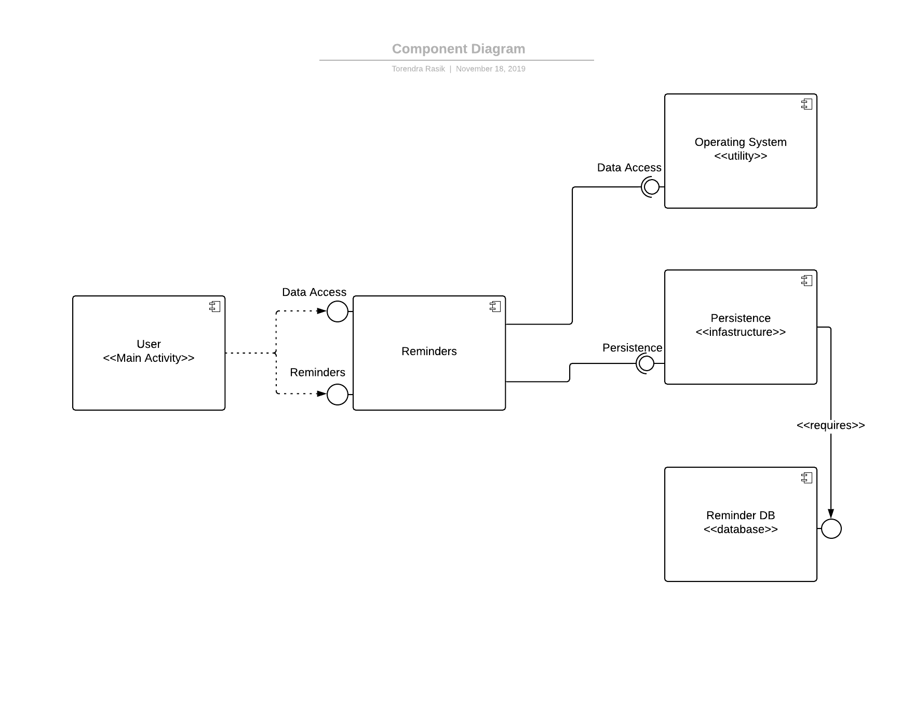
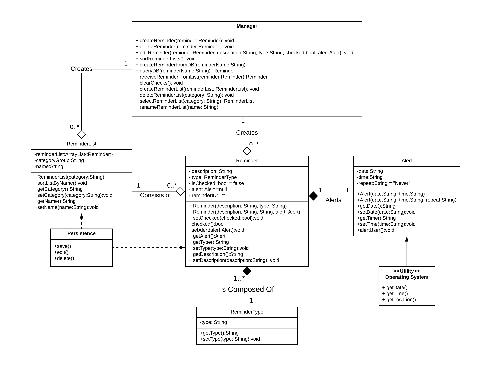

# Design Document

**Author**: Torendra Rasik, Jonas Improgo

## 1 Design Considerations

### 1.1 Assumptions

- The user is using an Android device.
- The Android devices has a built-in database, SQLite.
- The system is implemented using only the Java programming language on Android Studio.
- The requirements of the project is concrete and will not change.

### 1.2 Constraints

- The system is meant to fulfill the requirements of the project and may not include any extra features outside of the requirements.
- The time frame of the project is limited to the deadline of November 18, 2019.

### 1.3 System Environment

- The system is designed to work only on Android operating systems.

## 2 Architectural Design

- In our Architectural approach, we will be using an Event Driven Architecture (EDA) where certain activities or actions will change the state of the application.
For example, if the User was to press the Create button within the Main Activity the state of the application would change to the Create Reminder/List Activity. This approach seemed the best for our use because most Android Applications are based off a EDA where the state is constantly changing. 
- We will also be using a Data-centric approach within our Application, because a database is essential to the functionality of our Application. The data entered within the Application will be persisted throughout the lifecycle of the Application even when it is destroyed, so the data must be saved in that event/state. The database itself is contructed through a variation of tables that consist of primary and foreign keys that provide constraints so the data inserted is unique and correct. 

### 2.1 Component Diagram

### 2.2 Deployment Diagram

- This diagram seems to be unnecessary in our case because we a designing and creating a simple system with one functionality. This Application will be ran on devices that are running the Android software. It will also be using the onboard Database found in the Android OS rather than something external. Therefore, in terms of deployment it is unnecessary to create a diagram.

## 3 Low-Level Design

### User
- This component accesses the data in the Reminder component in order to provide management instructions for the User.
- It provides the functionality for the User in order to create, delete and edit ReminderLists. It also allows Users to create, delete, select, and re(name) their Reminders.
- This component also allows for Reminders to be saved through the database automatically.
- Within our design, this component is controlled through a Expandable List View and Adapter that has access from all the classes used in manipulating Reminders, Reminder Types, Alerts, etc. 

### Reminder
- This component provides the interface that is needed in order for the Reminder Manager to work.
- We have a Reminder class within this component that is created through a hierarchical system. This allows for better creation and grouping of Reminders so that it makes it easier on the User to view and manage their Reminders/ReminderLists
- We have a ReminderList class within this component that allows the User to create as many Lists as they want. It allows for concurrency support for the User in order to manage multiple Lists simultaneously.
- We have a Alert class within this component that if deemed necessary will allow the User to repeat Reminders based on their location, geolocation and also on a specified time. This class works in joint with the Android Operating System, which provides an interface to have data access to the location, geolocation and time of the User.

### Operating System
- This component provides an interface for the Reminders Component
- It allows for data access of the User's location, geolocation, and time 
- It's an on demand system that needs no development as it exists already on the Android Operating System.
- In our design, we decided to use the Broadcast Reciever already implemented within the Android OS to control when the User will recieve an Alert based on their input which is saved in the database.
- The Broadcast Reciever is also used in notifying the User on their device at the correct time that they wanted their reminder to notify them.
- The Dialog fragment was used in order to set the time the user wanted to by notified for a Reminder.

### Persistence
- This component provides an interface for the Reminders Component
- This is the one component that is the middle man between Reminders component and the database which allows for automatic saving
- This class allows for the backup saving and on demand saving of Reminders to allow the User to never worry about losing their data.

### Database
- This is the most important component within the Application that holds all the data for the User.
- It provides for automatic saving for the Application through the Persistence component.

### 3.1 Class Diagram

### 3.2 Other Diagrams
- There is no need for other diagrams as this is a simple application. It has basic functionality of managing Reminders which is shown through the use of the Class Diagram, Use Case Model, and Component diagram. These three diagrams provide more than enough information in order to plan out the construction of the Application.

## 4 User Interface Design

