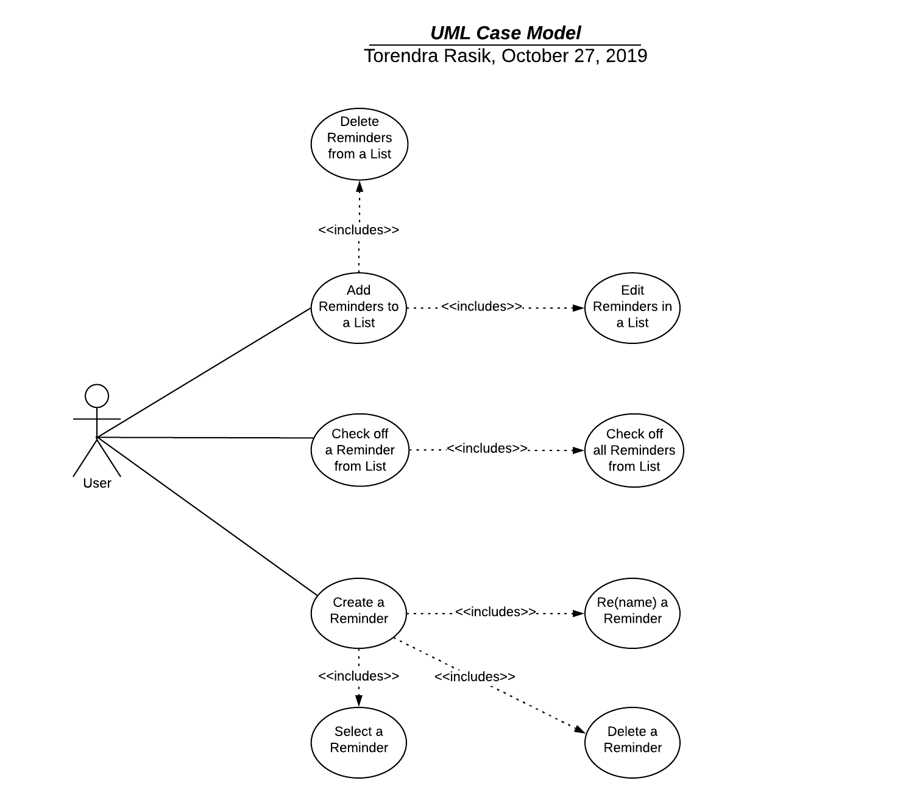

# Use Case Model

**Author**: Torendra Rasik

## 1 Use Case Diagram

## 2 Use Case Descriptions

1. ### Add Reminders to a List
- Pre-conditions: In order for the user to add a Reminder to a List, a List must exist first.
- Post-conditions: Once the User specifies the Reminder, it must be created from an instance and automatically saved to the database. It must also show within the User's List that he/she added it to.
- Scenarios: The User must first select a pre-exisiting list within the Application. After that they must be able to add Reminders to their list in the form of interacting with a button or popup. After the User enters the Reminder Type and Name, they will be able to select and confirmation button. Once pressed the Reminder will be added to the corresponding List and saved to the database, where the User will be able to view/keep track of it.

2. ### Delete Reminders from a List
- Pre-conditions: In order for the user to remove a Reminder from a List, a List must exist first.
- Post-conditions: Once the User specifies the Reminder via checkmark etc., it must be deleted from the corresponding list 
- Scenarios: The User must first select a pre-exisiting list within the Application. After that they must be able to remove Reminders to their list in the form of interacting with a button or popup. Once the user selects the delete button on a Reminder, it will be deleted from the List forever. 

3. ### Edit Reminders from a List
- Pre-conditions: In order for the user to edit a Reminder from a List, a List must exist first. The Reminder they want to edit must also exist.
- Post-conditions: Once the User selects a given Reminder they want to change, the Reminder constraints will be set to the new ones the User sets.
- Scenarios: The User must first select a pre-exisiting list within the Application. After this, the User will be able to select a given Reminder they want to change. The User will then be able change the contraints of the Reminder e.g Type, Name etc. and then press a button for confirmation. The Reminder that was selected will automatically be updated to whatever was changed by the User within the List.

4. ### Check off a Reminder from a List
- Pre-conditions: In order for the user to edit a Reminder from a List, a List must exist first. The Reminder they want to check off must also exist.
- Post-conditions: Once the User checks off a Reminder based on checkbox or mark, the Reminder will no longer be available e.g won't remind the User
- Scenarios: The User must first select a pre-exisiting list within the Application. After this, the User will be able to check off a Reminder via a checkbox or mark. This will be automatic, basically a toggle for the Reminder which will allow for the User to be reminded or not. 

5. ### Check off all Reminders from a List
- Pre-conditions: In order for the user to edit a Reminder from a List, a List must exist first. The Reminders they want to check off must also exist.
- Post-conditions: All the Reminders within a given List will be checked off meaning they will be toggled to not remind the User anymore. 
- Scenarios: The User must first select a pre-exisiting list within the Application. After this, the User will be able to just press a Check Off All button or popup. Once this is the done, the User will see that all Reminders within their list will be Checked Off e.g in the off position.

6. ### Create a Reminder 
- Pre-conditions: None
- Post-conditions: A new stand alone Reminder will be created not pertaining to any List at the moment.
- Scenarios: On the main Screen, the User will be able to press a button/popup to add a new Reminder. A new screen will show, which allows for the to create a new Reminder. They will be able to choose a Reminder Type and Name from this screen. If the type is not available, the User will be able to create a new one from this same screen. Once they confirm the new Reminder it will be added to the main screen where they can view it.

7. ### Select a Reminder
- Pre-conditions: Reminders must exist in order for the User to select one. 
- Post-conditions: The Reminder selected will not be highlighted. If many of them are selected, then those selected will be highlighted.
- Scenarios: Anywhere within the Application, the User will be able to press on a Reminder. Once pressed the Reminder will now be selected. The User can select as many Reminders as they want in order for them to be moved, deletec etc.

8. ### Re(name) a Reminder
- Pre-conditions: Reminders must exist in order for the User to re(name) one.
- Post-conditions: The Reminder that was selected will be changed to the new Name given by the User
- Scenarios: When the User selects a Reminder to be renamed they will be given a new popup where they will have the option to change the name of a Reminder. Here they will be shown the previous and new name if they pick one. Once renamed the Reminder will be automatically updated to show the User the new changes they made.

9. ### Delete a Reminder
- Pre-conditions: Reminders must exist in order for the User to delete one.
- Post-conditions: The Reminder will be deleted permanently from the Users' Application
- Scenarios: The User must first select a Reminder to be deleted. After that they must be able to remove Reminders to their list in the form of interacting with a button or popup. Once the user selects the delete button on a Reminder, it will be deleted from the Application forever. 